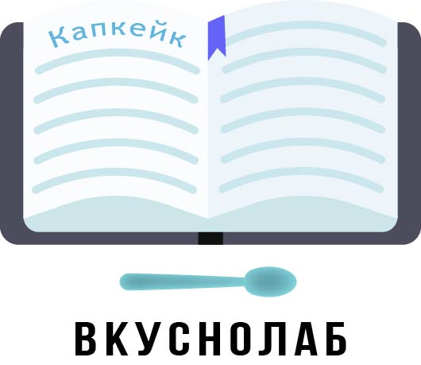

# ВКУСНОЛАБ | Ваш кулинарный помощник

### Приложение находится в стадии разработки
Данный репозиторий является репозиторием мобильного приложения.

Репозиторий API приложения: https://github.com/jottyVlad/vkusnolabAPI

Самые свежие изменения отслеживайте в ветках по фичам. Готовые фичи отслеживайте в ветке dev. 

Вкуснолаб - приложение, в котором вы можете делиться рецептами, создавать рецепты, а чтобы понять, сколько продуктов нужно купить к столу - достаточно просто добавить их в корзину из рецепта. 

Хотите разнообразить процесс выбора блюда? Надоело листать десятки рецептов? Искусственный интеллект поможет вам! 
